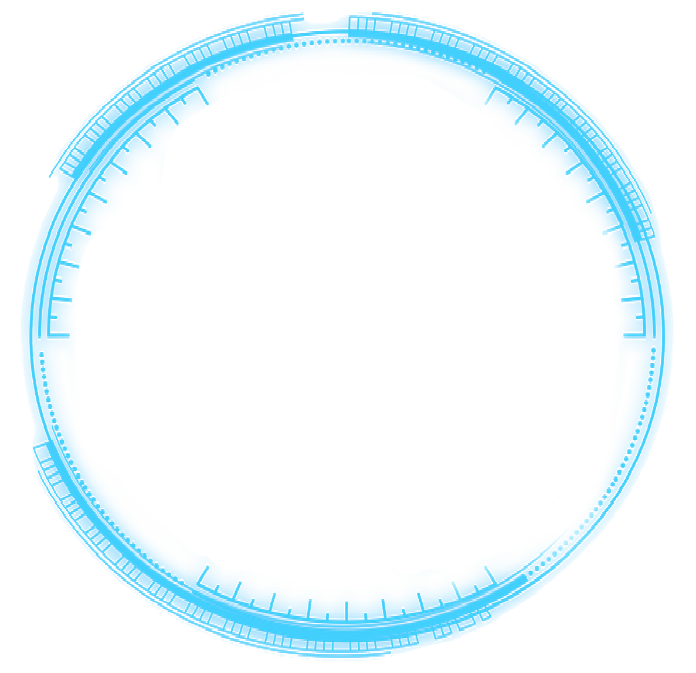

# Canvas动画案例

> 做大屏开发突然想到的一个轮盘转动实现,用的canvas-2d, 当然,这类效果使用webgl实现因该会更好,不过笔者webgl目前只学的点皮毛,实际应用还欠缺点经验.
>
> 基础的canvas API可以看这份[网道教程](http://wangdoc.com/webapi/canvas.html)
>
>完整代码在文末

## 预览效果如下


## 前期准备

### 资源

一张规则正圆的png或者svg图即可,下面即这次使用到的图片资源



### 开发工具

笔者使用Atom开发,因为可以实时预览书写的html界面,类似如下:


## 开发思路

本来打算使用gif做背景,这样就做不了交互效果,设计师给的又是这么一张正圆的图,如何做到类3d的斜二侧效果呢?后来思路一转,想想可以先用离屏渲染绘制一个正圆的canvas图像,再将离屏渲染的canvas绘制到按缩放比`1:0.3`绘制到页面canvas上,期间只需要绘制离屏渲染的canvas图像时改变图片旋转就可以达到扁平旋转

**基本准备**

```javascript
var item1 = null, //最外层
  item2 = null, // 中间层
  item3 = null; // 最内层
var _W = _H = 800;
var speed = 0.6, // 旋转速度, 正值顺时针
  radius = 400; // 图形半径
var canvas = document.getElementById('myCanvas');
var ctx = canvas.getContext('2d'); // 实际看到的canvas
canvas.width = _W;
canvas.height = _H;
var img = new Image();
img.src = './circle.svg';
// img.src = './img3.png';


```

为此,需要创建一个`CircleItem`类,用来完成单个圆环的旋转功能,类的实例属性有:

+ `_r`: 绘制半径,即最终椭圆的长轴
+ `_img`: 绘制的图像
+ `_w`: 离屏渲染的canvas宽度(2倍半径)
+ `_h`: 离屏渲染的canvas高度(2倍半径)
+ `_x`: 绘制在实际canvas上的中心x坐标
+ `_y`: 绘制在实际canvas上的中心y坐标
+ `speed`: 椭圆的旋转速度,每次刷新绘制时旋转的角度数(单位: °) speed=1 => 下一次绘制旋转Math.PI/180

```javascript
var CircleItem = function(img, r, x, y, speed) {
  this._r = r; // 半径
  this._img = img; // 图片
  this._w = r * 2; // 缓存canvas宽度
  this._h = r * 2; // 缓存canvas高度
  this._x = x; // 外部绘制中心
  this._y = y; // 外部绘制中心
  this._speed = speed;
  this.rectCenterPoint = {
    x: this._r,
    y: this._r
  }; // 内部圆心
  this.cache();
}
```

`CircleItem`初始化时将创建离屏渲染的缓存canvas,创建方法是定义在原型上的`cache`:

```javascript
CircleItem.prototype.cache = function() {
  this.cacheCanvas = document.createElement("canvas");
  this.cacheCtx = this.cacheCanvas.getContext("2d");
  this.cacheCanvas.width = this._w;
  this.cacheCanvas.height = this._h;
  this.cacheCtx.save();
  this.cacheCtx.beginPath();
  this.cacheCtx.drawImage(this._img, 0, 0, this._r * 2, this._r * 2);
  this.cacheCtx.closePath();
  this.cacheCtx.restore();
};
```

`CircleItem`类还需要有个绘制到实际canvas的方法`draw`,该方法每次刷新绘制时,先将实际canvas伸缩变换为比例`1:0.3`,将离屏渲染的图像绘制到canvas上,再将比例变换回来,这样显示在画布上的就是一个椭圆图像；绘制方法同样也是定义在原型上:

```javascript
CircleItem.prototype.draw = function() {
  this.rotate();
  ctx.scale(1, 0.3);
  ctx.drawImage(this.cacheCanvas, 0, 0, this._w, this._h, this._x - this._r, this._y - this._r, this._r * 2, this._r * 2);
  ctx.scale(1, 1 / 0.3);
};
```

当然,要达到动态的效果还需要在每次绘制前将图像旋转一定角度, 即定义在原型上的`rotate`方法, 要注意的是,默认旋转中心是`(0,0)`, 需要先将缓存的canvas进行平移变换到中心,再进行旋转:

```javascript
CircleItem.prototype.rotate = function() {
  this.cacheCtx.clearRect(0, 0, this._w, this._h);
  this.cacheCtx.translate(this.rectCenterPoint.x, this.rectCenterPoint.y);
  this.cacheCtx.rotate(this._speed * Math.PI / 180);
  this.cacheCtx.translate(-this.rectCenterPoint.x, -this.rectCenterPoint.y);
  this.cacheCtx.drawImage(this._img, 0, 0, this._r * 2, this._r * 2);
};
```

这样,`CircleItem`类的基本方法就定义好了,在图像加载完的回调方法中创建实例:

```javascript
img.onload = function() { // 图片加载完成是创建实例
  item1 = new CircleItem(img, radius, 400, 400, speed); // 图像, 图圆形长半径, 显示中心x,显示中心y, 旋转速度
  item2 = new CircleItem(img, radius - 80, 400, 400, -speed*1.5);
  item3 = new CircleItem(img, radius - 150, 400, 400, speed*2);
};
/*
// 也可以绘制不同的图像,以达到不同层次使用不同的轮盘或不同的转速
img.onload = function() {
  item1 = new CircleItem(img, radius, 400, 400, speed);
};
img2.onload = function() {
  item2 = new CircleItem(img, radius, 400, 400, speed*1.2); 
};
*/
```

最后,还需要定义一个`animate`方法来不断刷新新图像绘制,在重绘的实现上你可能会想到使用js 的 setTimeout() 方法，但是:
> setTimeout 和 setInterval 的问题是: 它们都不精确。它们的内在运行机制决定了时间间隔参数实际上只是指定了把动画代码添加到浏览器 UI 线程队列中以等待执行的时间。如果队列前面已经加入了其他任务，那动画代码就要等前面的任务完成后再执行。

所以我们需要使用另一个函数 —— `requestAnimationFrame()`:
>window.requestAnimationFrame() 方法告诉浏览器，你希望执行动画，并请求浏览器调用指定的函数在下一次重绘之前更新动画。该方法使用一个回调函数作为参数，这个回调函数会在浏览器重绘之前调用。

一般写动画都是使用`requestAnimationFrame`函数来请求重绘的。

`animate`方法实现如下:

```javascript
function animate() {
  ctx.clearRect(0, 0, _W, _H);
  item1 && item1.draw(); // 实例创建完成才绘制
  item2 && item2.draw();
  item3 && item3.draw();
  requestAnimationFrame(animate);
}
```

到此, 轮盘动画实现完毕!

**完整代码**:

```html
<!DOCTYPE html>
<html lang="en">

<head>
  <meta charset="UTF-8">
  <meta name="viewport" content="width=device-width, initial-scale=1.0">
  <meta http-equiv="X-UA-Compatible" content="ie=edge">
  <title>Document</title>
  <style>
    #myCanvas {
      border: 1px solid skyblue;
      background: rgba(12, 30, 78, 0.8);
    }
  </style>
</head>

<body>
  <canvas id="myCanvas" width="800" height="800">
    您的浏览器不支持 Canvas
  </canvas>

  <script>
    var item1 = null,
      item2 = null,
      item3 = null;
    var _W = _H = 800;
    var speed = 0.6, // 旋转速度, 正值顺时针
      radius = 400; // 图形半径
    var canvas = document.getElementById('myCanvas');
    var ctx = canvas.getContext('2d');
    canvas.width = _W;
    canvas.height = _H;
    var img = new Image();
    img.src = './circle.svg';
    img.onload = function() {
      item1 = new CircleItem(img, radius, 400, 400, speed); // 图像, 图圆形长半径, 显示中心x,显示中心y, 旋转速度
      item2 = new CircleItem(img, radius - 80, 400, 400, -speed*1.5);
      item3 = new CircleItem(img, radius - 150, 400, 400, speed*2);
    };
    var CircleItem = function(img, r, x, y, speed) {
      this._r = r; // 半径
      this._img = img; // 图片
      this._w = r * 2; // 缓存canvas宽度
      this._h = r * 2; // 缓存canvas高度
      this._x = x; // 外部绘制中心
      this._y = y; // 外部绘制中心
      this._speed = speed;
      this.rectCenterPoint = {
        x: this._r,
        y: this._r
      }; // 内部圆心
      this.cache();
    }
    CircleItem.prototype.draw = function() {
      this.rotate();
      ctx.scale(1, 0.3);
      ctx.drawImage(this.cacheCanvas, 0, 0, this._w, this._h, this._x - this._r, this._y - this._r, this._r * 2, this._r * 2);
      ctx.scale(1, 1 / 0.3);
    };
    CircleItem.prototype.cache = function() {
      this.cacheCanvas = document.createElement("canvas");
      this.cacheCtx = this.cacheCanvas.getContext("2d");
      this.cacheCanvas.width = this._w;
      this.cacheCanvas.height = this._h;
      this.cacheCtx.save();
      this.cacheCtx.beginPath();
      this.cacheCtx.drawImage(this._img, 0, 0, this._r * 2, this._r * 2);
      this.cacheCtx.closePath();
      this.cacheCtx.restore();
    };
    CircleItem.prototype.rotate = function() {
      this.cacheCtx.clearRect(0, 0, this._w, this._h);
      this.cacheCtx.translate(this.rectCenterPoint.x, this.rectCenterPoint.y);
      this.cacheCtx.rotate(this._speed * Math.PI / 180);
      this.cacheCtx.translate(-this.rectCenterPoint.x, -this.rectCenterPoint.y);
      this.cacheCtx.drawImage(this._img, 0, 0, this._r * 2, this._r * 2);
    };

    function animate() {
      ctx.clearRect(0, 0, _W, _H);
      item1 && item1.draw();
      item2 && item2.draw();
      item3 && item3.draw();
      requestAnimationFrame(animate);
    }
    animate();
  </script>
</body>
</html>

```